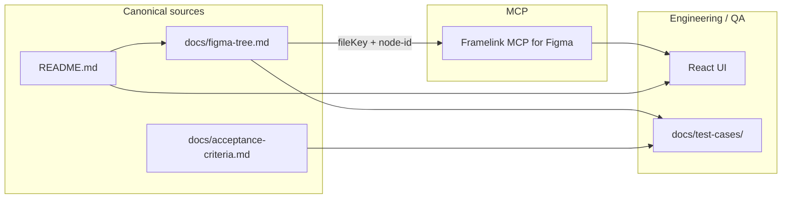
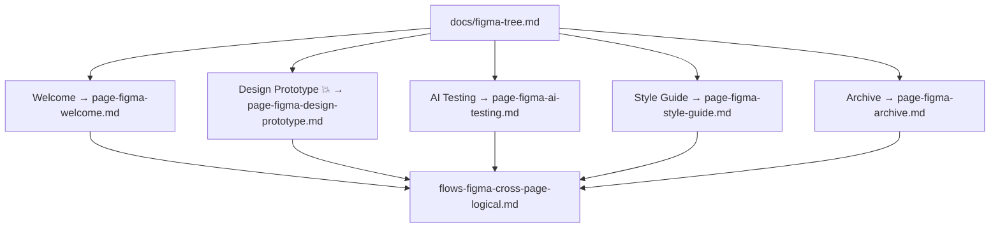

# Calculator Web Application

## Overview
A responsive calculator web application built with **React 18** on the frontend and **Node.js 24.x** on the backend. It supports basic arithmetic, scientific functions, memory operations, angle mode switching, keyboard interaction, and a rolling history of recent calculations.

## Recommended Stack
- **Frontend:** React 18, Vite, CSS Modules or plain modular CSS
- **Backend:** Node.js 24.x, Express.js
- **State Management:** React built-in state/hooks
- **API Style:** REST
- **History Persistence:** In-memory for V1, with an easy upgrade path to localStorage or database persistence

## Core Product Goals
- Deliver a fast, intuitive, and reliable calculator experience
- Support both everyday and scientific calculation needs
- Keep dependencies minimal and purposeful
- Provide responsive UI for **mobile, tablet, and desktop**
- Handle invalid input safely with clear user feedback

## Primary Features
- Basic arithmetic: addition, subtraction, multiplication, division
- Advanced operations: percentage, square root, exponents, sign toggle
- Trigonometric functions: sin, cos, tan with degree/radian toggle
- Logarithmic functions: log, ln
- Constants: π and e
- Memory functions: M+, M−, MR, MC
- Calculation history panel showing the last 10 calculations
- Keyboard support for common calculator interactions
- Friendly error handling for invalid scenarios

## Proposed Project Structure
```text
docs/
   ├─ main.md
   ├─ prd.md
   ├─ user-stories.md
   ├─ acceptance-criteria.md
   ├─ data-models.md
   ├─ edge-cases.md
   ├─ api-definitions.md
   └─ technical-constraints.md
```

## Architecture Summary
### Frontend Responsibilities
- Render calculator UI and history panel
- Manage input state, angle mode, memory state, and recent history state
- Support keyboard and button-driven interaction
- Show responsive layout and inline validation/error states

### Backend Responsibilities
- Safely evaluate submitted expressions and scientific operations
- Return normalized results and error responses
- Optionally store or return recent history entries for future persistence use cases
- Enforce request validation and controlled operation handling

## Suggested API Scope
- `POST /api/v1/calculate` → evaluate an expression or scientific operation
- `GET /api/v1/history` → retrieve recent calculations
- `POST /api/v1/history` → optionally add history entry if server-side persistence is used
- `DELETE /api/v1/history` → clear history if persistence is enabled

## Security / Reliability Notes
- Do **not** use raw `eval` on user input
- Use a controlled parsing/evaluation strategy on the backend
- Validate operation payloads and numeric inputs before execution
- Return user-friendly errors without exposing internal stack traces

## Future Enhancements
- Dark/light theme toggle
- Copy-to-clipboard for results
- Persistent history via localStorage or backend store
- Graph plotting for supported expressions

## Deliverables Included in Docs
- Product requirements
- User stories
- Acceptance criteria
- Data models
- API definitions
- Edge cases
- Technical constraints
- Suggested implementation structure
- **Figma MCP map:** `docs/figma-tree.md` (page-wise deep links for Framelink / `figma-developer-mcp`)

## Figma ↔ MCP workflow (diagram)

Use this when pulling specs from Figma via MCP so node IDs stay aligned with implementation and QA.



### Page-wise documentation map (design → tests)



## Agent execution TODO list (agent-owned deliverables)

Checklist run by Cursor / maintainers whenever design–MCP mapping or QA bundles change:

1. [x] **Inventory Figma pages** for file `efb6D9WRrFaSemoXuJOMxy` via REST (`GET /v1/files/:key?depth=...`) or MCP and record **every page** under `docs/figma-tree.md`.
2. [x] **Emit MCP-ready deep links** per top-level frame: URL `node-id` (hyphens) ↔ API colon form documented for `figma-developer-mcp`.
3. [x] **Freeze README entry**: treat **`668-2158` / `668:2158`** (**Container**, **AI Testing**) as canonical UI MCP entry unless product moves it—reflect parent **Calculator 3 (`668:2154`)** in the tree doc.
4. [x] **Page-by-page test bundles** under `docs/test-cases/page-figma-*.md` keyed to acceptance criteria and prominent frames.
5. [x] **Cross-page logical** suite in `docs/test-cases/flows-figma-cross-page-logical.md` for token ↔ shell ↔ prototype parity.
6. [ ] **Re-sync after Figma moves** — repeat steps 1–2 before merge whenever canvases rename or migrate.
7. [ ] **`FIGMA_API_KEY` MCP validation** — spot-check MCP resolves the same nodes as URLs in `docs/figma-tree.md`.
8. [ ] **`Agent.md`** — preserve code/doc style, automated tests on behavior changes; run tests before push.

---

## Agent-side checklist (maintenance TODOs)

Work owned by the agent / maintainers when evolving design ↔ code ↔ tests:

1. [ ] Keep **`docs/figma-tree.md`** in sync after Figma structural changes (re-export from file `efb6D9WRrFaSemoXuJOMxy` or refresh via Figma API).
2. [ ] Treat **`668-2158`** (**Container** on **AI Testing**) as the **README UI entry** unless product explicitly moves entry.
3. [ ] When adding Figma canvases or top-level frames, append **page-wise** rows and links (deep links + node ids) before merging.
4. [ ] Run **`FIGMA_API_KEY`**-backed MCP locally when validating that MCP tools resolve the same nodes as in `docs/figma-tree.md`.
5. [ ] After UI implementation, update **page-wise** tests under `docs/test-cases/page-figma-*.md` and **combined logical** tests in `docs/test-cases/flows-figma-cross-page-logical.md`.
6. [ ] Follow **`Agent.md`**: match code style, document complex logic, add automated tests for new behavior, run tests before push.
7. [ ] Ensure **`.gitignore`** stays appropriate for this repo (secrets, build artifacts).
