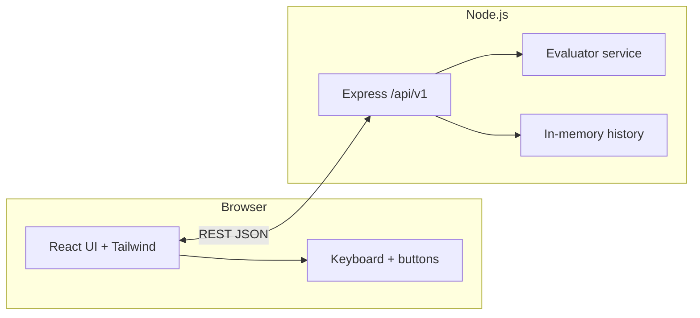

# Calculator Web Application

## Overview
A responsive calculator web application built with **React** (Vite scaffold) on the frontend and **Node.js 24.x** on the backend. It supports basic arithmetic, scientific functions, memory operations, angle mode switching, keyboard interaction, and a rolling history of recent calculations.

## Recommended Stack
- **Frontend:** React 18, Vite, CSS Modules or plain modular CSS
- **Backend:** Node.js 24.x, Express.js
- **State Management:** React built-in state/hooks
- **API Style:** REST
- **History Persistence:** In-memory for V1, with an easy upgrade path to localStorage or database persistence

## Core Product Goals
- Deliver a fast, intuitive, and reliable calculator experience
- Support both everyday and scientific calculation needs
- Keep dependencies minimal and purposeful
- Provide responsive UI for **mobile, tablet, and desktop**
- Handle invalid input safely with clear user feedback

## Primary Features
- Basic arithmetic: addition, subtraction, multiplication, division
- Advanced operations: percentage, square root, exponents, sign toggle
- Trigonometric functions: sin, cos, tan with degree/radian toggle
- Logarithmic functions: log, ln
- Constants: π and e
- Memory functions: M+, M−, MR, MC
- Calculation history panel showing the last 10 calculations
- Keyboard support for common calculator interactions
- Friendly error handling for invalid scenarios

## Repository layout (implemented)
```text
backend/                 # Express API — expression evaluation, in-memory history
   ├─ package.json
   ├─ .env.example
   └─ src/
       ├─ index.js
       ├─ app.js
       ├─ config.js
       ├─ middleware/errorHandler.js
       ├─ routes/calculate.js
       ├─ routes/history.js
       └─ services/
           ├─ evaluator.js   # expr-eval parser — no raw eval()
           └─ historyStore.js
frontend/                # React + Vite + Tailwind (UI aligned to responsive PRD)
   ├─ package.json
   ├─ .env.example         # VITE_API_BASE
   └─ src/
       ├─ main.jsx
       ├─ App.jsx
       ├─ api.js
       └─ index.css
docs/
   ├─ figma-tree.md        # Page-wise Figma URLs + MCP node-id reference
   ├─ tests/               # Functional test case packs (Markdown)
   └─ … (PRD, API, criteria, …)
```

## Design ↔ Figma (MCP)
- **Page-wise links & node ids:** `docs/figma-tree.md` lists each Figma page/frame with **file key** `efb6D9WRrFaSemoXuJOMxy`, **URL `node-id`**, and **API form** (`668:2158`) for MCP callers.
- **Mapping:** The live UI implements the **Container** shell from that file; use the doc when syncing tokens, spacing, or breakpoints with MCP-driven design extraction.

## Runtime architecture (diagram)


## Technology in use
| Layer | Choice | Notes |
|--------|--------|--------|
| Frontend | **React** (Vite scaffold), **Tailwind CSS v4** | Responsive calculator + history aside |
| Backend | **Node.js** (≥20; CI/target **24.x** per PRD), **Express** | `POST /api/v1/calculate`, `GET|POST|DELETE /api/v1/history` |
| Parsing | **expr-eval** (configured operators + unary overrides) | Trig respects `DEG` / `RAD`; `log` = base 10, `ln` = natural |
| History | In-memory ring buffer (10 items) | Matches V1 PRD; swap for DB later |

## Local development
1. **Backend:** `cd backend && npm install && npm run dev` (default **http://localhost:3000** unless `PORT` is set). Optional: copy `backend/.env.example` to `.env`.
2. **Frontend:** `cd frontend && npm install && npm run dev` (**http://localhost:5173**). Set `VITE_API_BASE` if the API is not on `http://localhost:3000` (see `frontend/.env.example`).
3. **Health:** `GET /health` on the API port.

## Agent delivery checklist (this implementation)
Rules reference: workspace `.cursor/rules` and `.cursor/agent` library (no `Agent.md` file was present in-repo).

| # | Task | Status Notes |
|---|------|----------------|
| A1 | Expand **`docs/figma-tree.md`** with page-wise URLs + MCP `fileKey` / `node-id` / colon form | Done |
| A2 | Add **architecture diagram** and **tech table** to **`README.md`** | Done |
| A3 | Implement **Express** calculator API per **`docs/api-definitions.md`** | Done |
| A4 | Implement **React** UI: scientific keys, memory, DEG/RAD, keyboard, history | Done |
| A5 | Author **Markdown test packs**: per-Figma page, **combined** flows, **logical** rules | `docs/tests/*.md` |

## Proposed Project Structure (documentation set)
```text
docs/
   ├─ main.md
   ├─ prd.md
   ├─ user-stories.md
   ├─ acceptance-criteria.md
   ├─ data-models.md
   ├─ edge-cases.md
   ├─ api-definitions.md
   ├─ technical-constraints.md
   ├─ figma-tree.md
   └─ tests/
       ├─ figma-page-1-container.md
       ├─ combined-flows.md
       └─ logical.md
```

## Architecture Summary
### Frontend Responsibilities
- Render calculator UI and history panel
- Manage input state, angle mode, memory state, and recent history state
- Support keyboard and button-driven interaction
- Show responsive layout and inline validation/error states

### Backend Responsibilities
- Safely evaluate submitted expressions and scientific operations
- Return normalized results and error responses
- Optionally store or return recent history entries for future persistence use cases
- Enforce request validation and controlled operation handling

## Suggested API Scope
- `POST /api/v1/calculate` → evaluate an expression or scientific operation
- `GET /api/v1/history` → retrieve recent calculations
- `POST /api/v1/history` → optionally add history entry if server-side persistence is used
- `DELETE /api/v1/history` → clear history if persistence is enabled

## Security / Reliability Notes
- Do **not** use raw `eval` on user input
- Use a controlled parsing/evaluation strategy on the backend
- Validate operation payloads and numeric inputs before execution
- Return user-friendly errors without exposing internal stack traces

## Future Enhancements
- Dark/light theme toggle
- Copy-to-clipboard for results
- Persistent history via localStorage or backend store
- Graph plotting for supported expressions

## Deliverables Included in Docs
- Product requirements
- User stories
- Acceptance criteria
- Data models
- API definitions
- Edge cases
- Technical constraints
- Figma tree + MCP linkage (`docs/figma-tree.md`)
- Suggested implementation structure
- Functional test case packs (`docs/tests/`)
